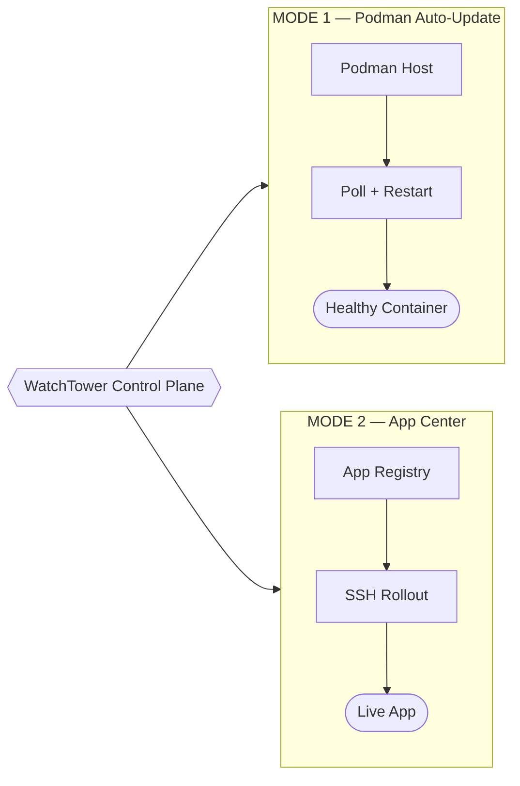
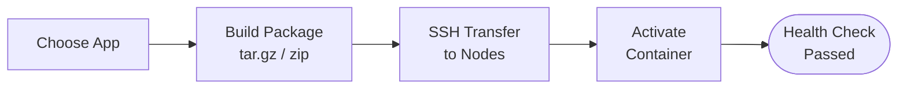
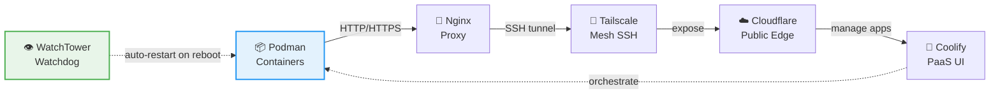
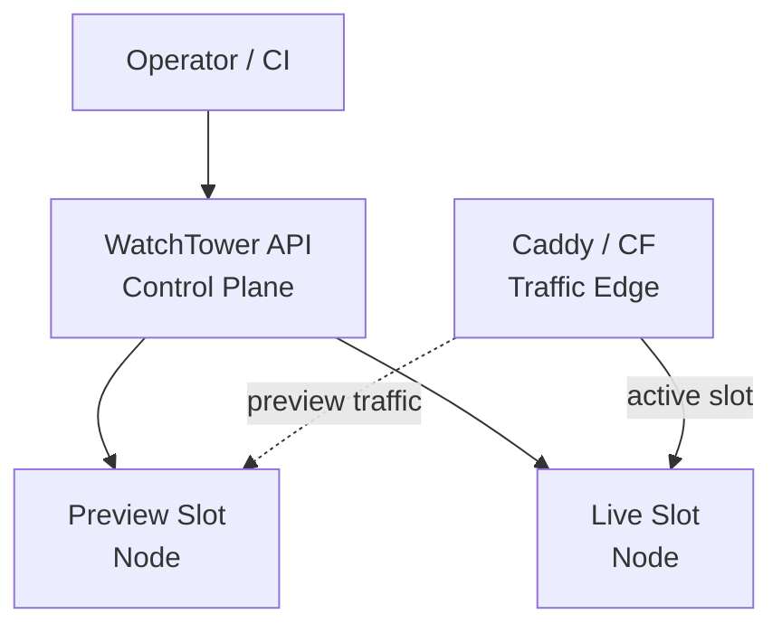
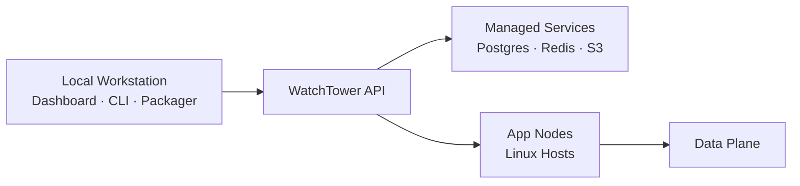
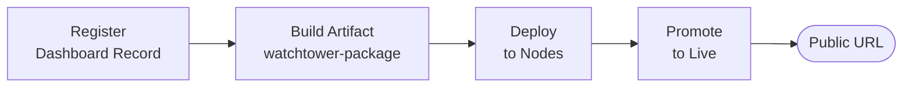
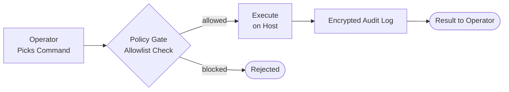

# WatchTower

<p align="center">
  <a href="https://github.com/sinhaankur/WatchTower/blob/main/LICENSE"></a>
  
  
  <a href="https://github.com/sinhaankur/WatchTower/pkgs/container/watchtower"></a>
  <a href="https://sinhaankur.github.io/WatchTower/"></a>
  <a href="https://github.com/sinhaankur/WatchTower/issues"></a>
</p>

<p align="center">
  <strong>Keep Podman containers current. Ship apps across your own nodes.</strong><br/>
  Operator-facing tooling for container auto-updates, multi-node deployments, and guided host operations — without handing control to a hosted platform.
</p>

## How They Work Together

**The complete integration stack:**

```
Podman runs containers → Nginx proxies traffic → Tailscale secures node SSH
  ↓
Cloudflare exposes to internet → Coolify provides PaaS UI → WatchTower watchdog
  ↓
Keeps it all alive after reboots
```

- **Podman** runs your containerized workloads
- **Nginx** routes HTTP/HTTPS traffic efficiently
- **Tailscale** creates a secure, encrypted mesh network for node SSH access
- **Cloudflare** exposes your applications to the internet with DDoS protection
- **Coolify** provides a clean PaaS interface for app deployment and management
- **WatchTower Watchdog** automatically restarts containers after any reboot or crash — **no manual intervention needed**

Manage everything from the **Integrations** page: see live connection status for all 6 tools, toggle the watchdog, and view install commands.

---

## Get Running in 30 Seconds

```bash
git clone https://github.com/sinhaankur/WatchTower.git
cd WatchTower
./run.sh
```

That's it. `run.sh` will:
- Create a Python virtualenv and install dependencies (first run only)
- Install Node packages (first run only)
- Build the frontend (first run only)
- Start the backend API on `127.0.0.1:8000`
- Launch the **Electron desktop app** if a display is available, otherwise open the browser at `http://127.0.0.1:5222`

**Other commands:**

| Command | What it does |
|---|---|
| `./run.sh desktop` | Force Electron desktop app |
| `./run.sh browser` | Force browser mode |
| `./run.sh stop` | Kill all WatchTower processes |
| `./run.sh logs` | Tail backend + frontend logs |

> **Requirements:** Python 3.8+, Node.js 18+, npm. Podman optional (only needed for container auto-update mode).

### Run With Docker

Use the single-node app compose file for a production-like local run:

```bash
git clone https://github.com/sinhaankur/WatchTower.git
cd WatchTower

# Optional: set your own strong token first
export WATCHTOWER_API_TOKEN="change-this-token"

docker compose -f docker-compose.app.yml up -d --build
```

Open `http://127.0.0.1:8000` and authenticate with the token you configured.

Useful Docker commands:

```bash
docker compose -f docker-compose.app.yml ps
docker compose -f docker-compose.app.yml logs -f watchtower
docker compose -f docker-compose.app.yml down
```

---

WatchTower is an operator-facing tool for two adjacent jobs:

1. **Keep existing Podman workloads current** with health-aware image updates.
2. **Deploy applications to your own nodes** with a compact control plane, SSH rollout, and operator-visible status.

The project is intentionally lightweight. It is not trying to replace a full PaaS. It gives teams a clear release path, host operations, and a dashboard-oriented workflow without hiding what happens underneath.

## What It Does

- **Container auto-update mode:** poll running containers, pull newer images, restart safely, and verify health.
- **App Center mode:** register workloads in `config/apps.json`, package from a dev machine, sync to nodes, activate remotely, and confirm rollout state.
- **Operator tooling:** expose guided actions, runtime inspection, and secure host operations from one control surface.

## Choose Your Path

- **Use Podman Auto-Update Service** if you already have a release process and only need safe host maintenance for containers.
- **Use App Center** if you want WatchTower to behave like a compact deployment control plane for websites, APIs, previews, and multi-node rollouts.
- **Use Host Connect / secure terminal flows** if the team needs guided host actions without opening an unrestricted shell path.

## Why It Is Different

- **Explicit deploy flow:** operators can see app selection, artifact creation, sync, activation, and health verification as separate steps.
- **Own-your-infrastructure model:** deploy to your own Linux nodes over SSH instead of handing control to a hosted platform.
- **Consistent UX:** the desktop app, web UI, GitHub Pages docs, and architecture diagrams all explain the same product model.
- **Desktop-first, AI-agent ready:** ships as a real Electron app with system-tray integration, native folder pickers, OS-level notifications, and a built-in agent surface — not a web app dressed up as a desktop one.

---

## What's New in 1.5.14

### Diagnostics surface that detects + fixes its own problems

- **Settings → System tab.** Probes Python, Podman/Docker, and the bundled Nixpacks binary at runtime; shows status badges (Found / Missing) and **per-platform copy-paste install commands** for anything missing — `brew install python@3.11`, `winget install RedHat.Podman`, `sudo apt install -y podman`, etc. **Recheck** restarts the app so PATH refreshes after a terminal install. The first step toward an autonomous-ops control plane: detect → diagnose → fix → verify, in one screen.
- **Send Error Report (mailto with diagnostics auto-attached).** One click in Settings → System or in the header opens the user's mail client pre-filled with platform, app version, dependency status, and the last 200 lines of the desktop-backend log — addressed to the maintainer. The user reviews the email body before clicking send; the app never sends anything itself.
- **Silent auto-update.** Removed the *"Update Available"* and *"Restart Now / Later"* dialogs from the packaged path. Updates download in the background and apply on next quit (`autoInstallOnAppQuit=true`); a single non-blocking OS notification fires when the download finishes. No more mid-task interruption.

### Distribution

- **VS Code Marketplace published as `sinhaankur.watchtower-podman`** ("WatchTower Ops"). Install with:
  ```bash
  code --install-extension sinhaankur.watchtower-podman
  ```
  Slug matches the PyPI package (`pip install watchtower-podman`) so users have one mnemonic across both channels.

## What's New in 1.5.13

- **macOS launch crash fixed.** `spawn /Applications/Xcode.app` errors caused by the `/usr/bin/python3` Command Line Tools stub triggering the Xcode CLT installer mid-launch. Detection now skips the stub and surfaces an actionable "install Python" dialog instead of crashing.
- **Splash logo restored.** Inlined `wt-logo.svg` directly into `splash.html` — the previous external `` 404'd in packaged builds because `assets/` wasn't listed in `desktop/package.json`'s `files` array.
- **Top-level `uncaughtException` + `unhandledRejection` safety net** in the Electron main process. Spawn-side errors (missing PATH, permission denied, the macOS stub) no longer surface Electron's raw "A JavaScript error occurred" dialog — users see a friendly errorBox with a hint that exits cleanly.
- **Splash version label is now real.** Was hardcoded `v1.2.2` and stayed wrong through every release between 1.2.2 and 1.5.12; now injected from `app.getVersion()` via `webContents.executeJavaScript` on `dom-ready`.

## What's New in 1.5.12

The 1.5.x series — and especially the 1.5.10 → 1.5.12 cluster — moved WatchTower decisively in the *desktop-first, integrate-don't-rebuild* direction. Highlights:

### Setup that actually works

- **Auto-recommended ports.** Setup wizard picks a free port from 3000–3999 (race-free `bind`-and-release, skips ports already assigned to your other projects) and surfaces it as *"We'll deploy on port X"* with a single-click **Edit** override. No more silent fallback to a port that's already in use.
- **Native folder picker for local-source projects.** Click **Browse…** in the Setup Wizard's *Local folder* tab — get the OS file dialog instead of typing absolute paths. (Desktop only; browser mode falls back to a text input.)
- **GitHub avatars + names show up after sign-in.** Previously the sidebar identity badge fell back to the initial-letter placeholder forever; now the user's GitHub avatar persists across sessions and refreshes on every login.
- **Sign out is sticky.** A new `wt:explicitlySignedOut` sentinel prevents the dev / Electron auto-token path from silently re-authenticating you the moment you click Sign out. Sentinel clears on any deliberate sign-in (GitHub OAuth, guest, manual token, device flow).

### Build pipeline foundations

- **Nixpacks bundled into the desktop installer.** ~36 MB of platform-specific binaries (Linux x64/arm64, macOS x64/arm64) ship inside the Electron app via `electron-builder` `extraResources` so users can deploy without first installing Rust + Cargo + Nix. Resolution order is `WATCHTOWER_NIXPACKS_BIN` → bundled → system PATH. (The local-Podman runner that *consumes* this lands in 1.5.13.)
- **`GET /api/runtime/nixpacks-status`** exposes `{available, source, path, version, version_drift, platform_supported}` so the SPA can surface an actionable banner instead of silently failing a build.
- **Build queue stops dropping deploys at PENDING.** A long-standing bug where `enqueue_build` passed `str(deployment.id)` to a SQLAlchemy `Uuid` column (which calls `.hex` on the parameter) silently killed every queued build at the first DB query. Fixed at the top of `_run_build` with proper UUID coercion.

### UI that doesn't lie to the user

- **Projects no longer vanish from the dashboard.** Created projects were filed under the canonical user id (resolved via email) but read paths filtered by the token-synthetic UUID5, so projects disappeared the instant the token rotated. New `util.canonical_user_id()` resolver canonicalizes 20 read paths across `projects.py`, `deployments.py`, `builds.py`, `notifications.py`, `envvars.py`, `runtime.py`, and `agent.py`.
- **Real "Update Now" button.** Banners and the sidebar version line now actually trigger the Electron auto-updater (or the dev-clone `git pull` + rebuild + relaunch) instead of routing to a Settings page that only had a *Check* button.
- **−27% cold-start bundle.** 14 page components moved out of the main JS bundle behind `React.lazy + Suspense`. Cold-start went from 706 KB → 517 KB raw (204 KB → 164 KB gzipped); each route loads its own ~3–25 KB chunk on first navigation.

### Distribution

- **Per-arch macOS installers.** Switched from a single fat universal `.dmg` to separate **x64** and **arm64** installers — half the per-install download, no `@electron/universal` fragility around bundled per-arch tools.
- **VS Code extension installs on VS Code 1.80+.** Previously gated to 1.90+ (about a year of releases locked out). Bundled with esbuild so the `.vsix` is now **10 KB across 6 files** (was ~52 KB across 13 files); single-file load = faster activation.
- **Sidebar deduplicated, color tokens unified.** Removed the redundant icon-only second sidebar that rendered alongside the main one in Electron mode. 27 hand-rolled `hsl(214 …)` color literals across 11 files migrated to two design tokens (`--border-soft`, `--surface-soft`) so palette changes are now a single edit.

### Behind the scenes

- **Backend test count: 99 → 121** (test files: 8 → 14). New coverage for canonical-user-id resolution, builder UUID coercion, port recommendation, and Nixpacks resolution.
- **Branch protection on `main`.** Build (Linux/macOS/Windows matrix) + Trivy filesystem & container scans must pass before merge.
- **Stale `chore/release-*` branches and unused workflows pruned.** Repository is back to a single canonical branch (`main`) with a clean release pipeline.

> See `git log v1.5.10..v1.5.12 --oneline` for the full commit list, or browse [the Releases page](https://github.com/sinhaankur/WatchTower/releases) for installer downloads.

---

## 🚀 Ready for Beta Testing & Production

WatchTower is **fully functional** and suitable for:
- ✅ **Beta testing** — Deploy to preview environments, test with real infrastructure
- ✅ **Production use** — Multi-node HA setup, auto-restart watchdog, encrypted backups
- ✅ **Cost reduction** — Cut deployment costs by 60–80% compared to Vercel or similar PaaS

### Available for Download

**Current Version: 1.5.12**

| Channel | How to Get | Use Case |
|---------|-----------|----------|
| **Docker** | `docker pull ghcr.io/sinhaankur/watchtower:latest` | Production & staging |
| **Python** | `pip install watchtower-podman` | Development & automation |
| **Source** | [GitHub Releases](https://github.com/sinhaankur/WatchTower/releases) | Development, customization |
| **Git** | `git clone https://github.com/sinhaankur/WatchTower.git` | Contributor setup |

### Key Documentation

- **[SETUP_RELEASES.md](./SETUP_RELEASES.md)** ← **START HERE** — Release status, download options, branch protection setup
- **[docs/VERCEL_ALTERNATIVE.md](./docs/VERCEL_ALTERNATIVE.md)** — Why WatchTower replaces Vercel; feature parity comparison; migration guide; cost savings
- **[RELEASE.md](./RELEASE.md)** — How to create releases, manage versions, and download specific releases
- **[BRANCH_PROTECTION.md](./BRANCH_PROTECTION.md)** — How to protect the main branch and enforce code review standards

### Get Started Now

```bash
# Single node (30 seconds)
git clone https://github.com/sinhaankur/WatchTower.git && cd WatchTower && ./run.sh

# Docker (production-like)
docker compose -f docker-compose.app.yml up -d

# High Availability setup
docker compose -f deploy/docker-compose.ha.yml up -d
```

---

## Visual Blueprints

These diagrams are the fastest way to understand WatchTower before reading setup guides. Click any image to open the full interactive viewer.

### Modes Overview

> Two operating modes — keep existing containers current, or run a full app delivery pipeline.



### Deployment Process

> The App Center release path: choose an app, build an artifact, sync to nodes, activate, confirm health.



### Integration Stack

> Podman, Nginx, Tailscale, Cloudflare, Coolify, and WatchTower working as one autonomous system.



### Mesh Topology

> Preview traffic, live traffic, and mesh routing decisions at a glance.



### Hybrid Stack

> Your control plane stays local; data and services live where you put them.



### Application & Web App Surface

> How a dashboard-registered app record becomes a URL your users can open.



### Secure Terminal Command Flow

> How guided host operations stay useful without exposing a raw shell.



---

## Core Features

### Container Auto-Update Features

- Automatic container update monitoring (Podman-first)
- Smart scheduling (interval-based today, cron-style roadmap)
- Include/exclude filtering with wildcard patterns
- Configuration preservation across updates
- Post-update health verification
- Graceful stop/start update process
- Optional old image cleanup after success
- Dry-run / monitor-only mode
- Rotating logs with configurable verbosity
- CLI for manual operations and status checks
- Systemd integration for service management

### App Center Features

- App registration through `apps.json`
- Multi-node SSH deployment workflows
- Dashboard-oriented UI for projects and deploy activity
- API-based deployment triggers per app
- Portable package builder (`tar.gz` / `zip`) for Linux, Windows, macOS, and generic targets

### Platform and Distribution Features

- **Desktop app**: Electron build with native system tray, **OS-level notifications** (deploy completion / build failure), **native folder picker** for local-source projects, sticky sign-out, and in-app **Update Now** wired to `electron-updater`. Per-arch installers for Linux (x86_64, arm64, armv7l), macOS (x64, arm64), and Windows (x64, arm64).
- **VS Code extension** (`sinhaankur.watchtower-podman`, "WatchTower Ops" on the marketplace): WatchTower sidebar inside the editor — projects, deploy actions, deployment logs, and a status bar item. Install: `code --install-extension sinhaankur.watchtower-podman`. Runs on VS Code **1.80+**, ~10 KB `.vsix`, esbuild-bundled.
- **Bundled build tooling**: Nixpacks v1.41.0 binaries (Linux x64/arm64, macOS x64/arm64) shipped inside the desktop installer via `extraResources` so users don't need Rust + Cargo + Nix to deploy.
- Linux App Center installer (`install_app_center.sh`)
- Windows App Center installer and runner scripts
- macOS App Center installer and runner scripts
- GHCR image publishing, PyPI publishing, and release automation
- GitHub Pages docs deployment

---

## Requirements

- **Operating System:** Ubuntu/Linux (primary); Windows/macOS supported for App Center workflows
- **Python:** 3.8+
- **Podman:** 3.0+
- **Permissions:** root or Podman socket access for container service mode

---

## Installation

### Publish Option 3 (Containers + PyPI)

If you selected both distribution channels, this repository now supports:

1. **GitHub Container Registry (GHCR)**
  - Workflow: `.github/workflows/publish-container.yml`
  - Publishes image: `ghcr.io/<owner>/watchtower`
  - Trigger: push to `main`, version tags (`v*`), or manual dispatch

2. **PyPI package publishing**
  - Workflow: `.github/workflows/publish-pypi.yml`
  - Publishes project: `watchtower-podman`
  - Trigger: version tags (`v*`) or manual dispatch

3. **GitHub Release creation**
  - Workflow: `.github/workflows/release.yml`
  - Trigger: version tags (`v*`)
  - Validates that tag version matches `watchtower.__version__`

One-time setup needed:

- In GitHub repo settings, allow workflow permissions to write packages.
- In PyPI, configure Trusted Publishing for this repository.
- Use release tags (for example `v1.1.1`) to produce versioned artifacts.

Version-controlled release process:

1. Bump `watchtower/__init__.py` version (single source of truth).
2. Commit and merge to `main`.
3. Create and push a semantic tag like `v1.1.1`.
4. GitHub Actions will automatically:
  - Create GitHub Release notes
  - Publish container image to GHCR
  - Publish package to PyPI

Optional helper command:

```bash
./scripts/release.sh 1.2.2
```

### GitHub Pages Documentation Site

- Source files are in `docs/`
- Deployment workflow: `.github/workflows/deploy-pages.yml`
- URL: `https://sinhaankur.github.io/WatchTower/`

If Pages has never been enabled on this repository:

1. Open repository settings -> Pages
2. Under Build and deployment, select Source: `GitHub Actions`
3. Run the `Deploy Docs Site` workflow once (or push docs changes)

### One-Command App Center Install (Linux)

```bash
sudo ./install/install_app_center.sh
```

This installer:

- Installs runtime dependencies (`python3`, `venv`, `git`, `rsync`, SSH client)
- Installs WatchTower into `/opt/watchtower/.venv`
- Sets up `/etc/watchtower/nodes.json` and `/etc/watchtower/apps.json`
- Creates and starts `watchtower-appcenter` systemd service

Post-install checks:

```bash
sudo systemctl status watchtower-appcenter
curl http://<server-ip>:8000/health
```

### Windows Installation (App Center)

```powershell
powershell -ExecutionPolicy Bypass -File .\install\install_windows.ps1
powershell -ExecutionPolicy Bypass -File .\install\run_app_center_windows.ps1
```

Default paths:

- Install dir: `%USERPROFILE%\\WatchTowerAppCenter`
- Config dir: `%USERPROFILE%\\WatchTowerConfig`

Health check:

```bash
curl http://127.0.0.1:8000/health
```

### macOS Installation (App Center)

```bash
./install/install_macos.sh
./install/run_app_center_macos.sh
```

Default paths:

- Install dir: `~/watchtower-appcenter`
- Config dir: `~/.watchtower`

Health check:

```bash
curl http://127.0.0.1:8000/health
```

### Ubuntu/Linux Installation (Container Auto-Update Service)

1. Install Podman:

```bash
sudo apt update
sudo apt install podman
```

2. Clone repository:

```bash
git clone https://github.com/sinhaankur/WatchTower.git
cd WatchTower
```

3. Install dependencies and package:

```bash
pip3 install -r requirements.txt
sudo python3 setup.py install
```

4. Create directories:

```bash
sudo mkdir -p /etc/watchtower
sudo mkdir -p /var/log/watchtower
```

5. Copy and edit config:

```bash
sudo cp config/watchtower.yml /etc/watchtower/
sudo nano /etc/watchtower/watchtower.yml
```

6. Enable service:

```bash
sudo cp systemd/watchtower.service /etc/systemd/system/
sudo systemctl daemon-reload
sudo systemctl enable watchtower
sudo systemctl start watchtower
```

### Manual Installation (Development)

```bash
pip3 install -r requirements.txt
python3 -m watchtower --help
```

---

## Configuration

WatchTower searches for `watchtower.yml` in:

- `/etc/watchtower/watchtower.yml`
- `/opt/watchtower/config/watchtower.yml`
- `./config/watchtower.yml`
- `./watchtower.yml`

Example:

```yaml
watchtower:
  interval: 300
  cleanup: true
  monitor_only: false

containers:
  include: []
  exclude:
    - "database-*"
    - "postgres"

notifications:
  enabled: true
  type: "log"

logging:
  level: "INFO"
  file: "/var/log/watchtower/watchtower.log"
  max_size: "10MB"
  backup_count: 5
```

### Configuration Options

- `watchtower.interval`: update check interval (seconds)
- `watchtower.cleanup`: remove old images after update
- `watchtower.monitor_only`: check only, no apply
- `containers.include` / `containers.exclude`: wildcard filtering
- `notifications.enabled` / `notifications.type`: `log`, `email`, `webhook`
- `logging.level`, `logging.file`, `logging.max_size`, `logging.backup_count`

---

## Usage

### Container Service CLI

```bash
watchtower start
watchtower -c /path/to/config.yml start
watchtower status
watchtower update-now
watchtower list-containers
watchtower validate-config
```

### Deployment Orchestrator / App Center Mode

Start API server:

```bash
watchtower-deploy serve --host 0.0.0.0 --port 8000
```

Dashboard UI:

```text
http://<server-ip>:8000/dashboard
```

Primary API endpoints:

- `GET /ui/data`
- `GET /apps`
- `POST /apps/{app_name}/deploy`

Required environment variables:

```bash
export WATCHTOWER_REPO_DIR=/opt/website
export WATCHTOWER_NODES_FILE=/opt/watchtower/nodes.json
export WATCHTOWER_APPS_FILE=/opt/watchtower/apps.json
export WATCHTOWER_TRIGGER_TOKEN=change-me
```

On Windows and macOS, platform installer/run scripts write and load these automatically from `appcenter.env`.

Deploy by app name:

```bash
WATCHTOWER_BASE_URL=http://server:8000 WATCHTOWER_TOKEN=change-me ./scripts/deploy.sh --app website-main main
```

List registered apps:

```bash
curl -H "X-Watchtower-Token: change-me" http://server:8000/apps
```

Trigger deployment from dev machine:

```bash
WATCHTOWER_URL=http://server:8000/deploy WATCHTOWER_TOKEN=change-me ./scripts/deploy.sh main
```

One-off server deploy commands:

```bash
watchtower-deploy deploy-now --branch main
watchtower-deploy deploy-app --app website-main --branch main
```

Package builder examples:

```bash
watchtower-package --name website-main --source ./dist --target linux --format tar.gz
watchtower-package --name desktop-client --source ./build --target windows --format zip
```

Generated output includes:

- archive bundle (`.tar.gz` / `.zip`)
- manifest JSON with target metadata

---

## Running as a Service

```bash
sudo systemctl start watchtower
sudo systemctl stop watchtower
sudo systemctl restart watchtower
sudo systemctl status watchtower
sudo journalctl -u watchtower -f
sudo tail -f /var/log/watchtower/watchtower.log
sudo systemctl enable watchtower
```

---

## How Container Update Flow Works

1. Discover running Podman containers
2. Apply include/exclude filters
3. Check for newer images
4. Pull updated image
5. Gracefully stop old container
6. Recreate with preserved config (env, ports, volumes, restart policy, labels, args)
7. Verify container health
8. Optionally clean old images
9. Emit logs/notifications

---

## Practical Configuration Examples

### Monitor all containers

```yaml
containers:
  include: []
  exclude: []
```

### Monitor specific containers

```yaml
containers:
  include:
    - "nginx"
    - "redis"
    - "app-*"
  exclude: []
```

### Exclude databases

```yaml
containers:
  include: []
  exclude:
    - "postgres"
    - "mysql"
    - "mongodb"
    - "database-*"
```

### Dry-run mode

```yaml
watchtower:
  monitor_only: true
```

### Frequent checks

```yaml
watchtower:
  interval: 60
```

---

## Troubleshooting

### WatchTower won’t start

```bash
podman --version
watchtower validate-config
ls -la /run/podman/podman.sock
```

### Containers not updating

```bash
watchtower list-containers
sudo tail -f /var/log/watchtower/watchtower.log
```

Also verify include/exclude rules and image/tag behavior.

### Permission denied

Run as root or configure appropriate Podman socket permissions.

### No updates detected

```bash
podman pull <image-name>
```

Confirm registry accessibility and image tag semantics.

---

## Security

### Security Hardening

Recommended production setup:

```bash
export WATCHTOWER_API_TOKEN="change-this-to-a-long-random-token"
export WATCHTOWER_SECRET_KEY="$(python3 - <<'PY'
from cryptography.fernet import Fernet
print(Fernet.generate_key().decode())
PY
)"
```

Then run your service/deployment stack.

Notes:

- API auth uses timing-safe token comparison.
- Enterprise GitHub tokens are encrypted at rest with `WATCHTOWER_SECRET_KEY`.
- Insecure dev auth is disabled by default.

Dev-only bypass (never in production):

```bash
export WATCHTOWER_ALLOW_INSECURE_DEV_AUTH=true
```

### Secure Terminal Command Runner (Host Connect)

Host Connect includes a secure command runner for operational commands.

- Strict allowlist only (no arbitrary shell)
- Command-level sudo controls
- Encrypted execution audit log

Enable it by setting:

```bash
export WATCHTOWER_TERMINAL_AUDIT_KEY="$(python3 - <<'PY'
from cryptography.fernet import Fernet
print(Fernet.generate_key().decode())
PY
)"
```

If missing, terminal execution is disabled by design.

### Website Security Baseline (Recommended)

- Protect deploy API with strong `WATCHTOWER_TRIGGER_TOKEN`
- Keep API private to LAN/VPN where possible
- Apply firewall allowlists for admin/dev IPs
- Use dedicated non-root deploy user on nodes
- Keep `sudoers` narrow (avoid broad `NOPASSWD:ALL`)
- Enforce SSH key-based auth; disable password auth
- Enforce HTTPS/TLS and modern security headers
- Centralize logs, rotate logs, keep backups, and test rollback plans

Minimal safe deployment checks:

```bash
sudo systemctl status watchtower-appcenter
curl http://<server-ip>:8000/health
```

For internet-facing deployments, place App Center behind VPN/auth gateway.

### Security CI (Automated)

- Workflow: `.github/workflows/security-scan.yml`
- Triggered on PRs and pushes to `main`
- Scans filesystem and built container image
- Fails on HIGH/CRITICAL vulnerabilities (except unfixed CVEs)

---

## Release and Publishing

### Publish Option 3 (Containers + PyPI)

This repository supports:

- **GHCR publishing**
  - Workflow: `.github/workflows/publish-container.yml`
  - Image: `ghcr.io/<owner>/watchtower`
  - Trigger: `main`, tags `v*`, or manual dispatch

- **PyPI publishing**
  - Workflow: `.github/workflows/publish-pypi.yml`
  - Package: `watchtower-podman`
  - Trigger: tags `v*` or manual dispatch

- **GitHub Release creation**
  - Workflow: `.github/workflows/release.yml`
  - Trigger: tags `v*`
  - Validates tag matches `watchtower.__version__`

One-time setup:

- Enable workflow package write permissions in repository settings
- Configure PyPI Trusted Publishing for this repository
- Use semantic release tags (for example `v1.1.1`)

Version-controlled release process:

1. Bump `watchtower/__init__.py` version.
2. Commit and merge to `main`.
3. Create and push a semantic tag, for example `v1.1.1`.
4. Actions automatically:
   - create release notes
   - publish GHCR image
   - publish PyPI package

Optional helper:

```bash
./scripts/release.sh 1.1.1
```

---

## GitHub Pages Documentation Site

- Source: `docs/`
- Workflow: `.github/workflows/deploy-pages.yml`
- URL: <https://sinhaankur.github.io/WatchTower/>

If Pages has never been enabled:

1. Open repository settings -> Pages
2. Set Build and deployment source to **GitHub Actions**
3. Run **Deploy Docs Site** once (or push docs changes)

---

## Development

### Project Structure

```text
watchtower/
├── watchtower/
│   ├── __init__.py
│   ├── __main__.py
│   ├── main.py
│   ├── cli.py
│   ├── config.py
│   ├── logger.py
│   ├── podman_manager.py
│   ├── updater.py
│   └── scheduler.py
├── config/
├── systemd/
├── tests/
├── docs/
├── scripts/
├── README.md
└── setup.py
```

### Running Tests

```bash
pip3 install pytest pytest-cov
pytest tests/
pytest --cov=watchtower tests/
```

### Contributing

1. Fork repository
2. Create feature branch
3. Make changes
4. Add tests
5. Ensure tests pass
6. Submit pull request

For full contributor guidance, see `CONTRIBUTING.md`.

---

## Extending WatchTower (Contributors)

Common extension areas:

- New deployment integrations and rollout strategies
- Notification/observability (email, webhooks, metrics)
- Pre-deploy safety checks and automated rollback
- Packaging target expansion and artifact signing

When adding features, include:

- success/failure tests
- README/config updates
- security impact and safe defaults

---

## Roadmap

- broader Docker parity and runtime features
- Windows and macOS container-service depth
- richer notification integrations
- enhanced monitoring/metrics integrations
- stronger rollback and scheduling controls

---

## License

MIT License. See `LICENSE`.

## Support

- Issues: <https://github.com/sinhaankur/WatchTower/issues>
- Docs: <https://github.com/sinhaankur/WatchTower>

## Acknowledgments

- Inspired by Docker Watchtower patterns
- Built for Podman-first workflows
- Thanks to all contributors

---

> Note: WatchTower performs automated update/deployment operations. Always validate in non-production environments first and keep reliable backups before production rollouts.
