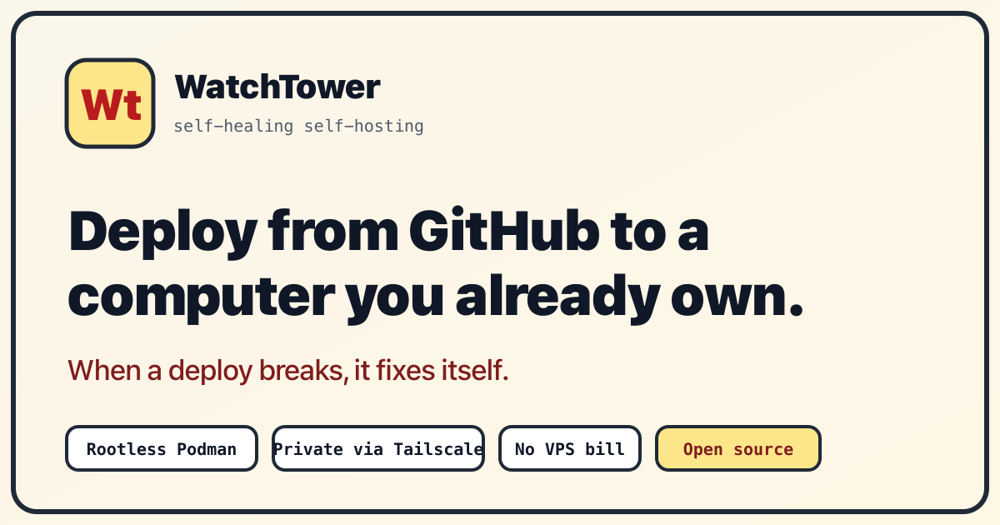

<p align="center">
  
</p>

<h1 align="center">WatchTower</h1>

<p align="center">
  <a href="https://github.com/sinhaankur/WatchTower/releases/latest"></a>
  <a href="https://github.com/sinhaankur/WatchTower/blob/main/LICENSE"></a>
  
  
  <a href="https://github.com/sinhaankur/WatchTower/pkgs/container/watchtower"></a>
  <a href="https://github.com/sinhaankur/WatchTower/issues"></a>
</p>

<p align="center">
  <strong>Turn the computers you already own into your personal cloud.</strong><br/>
  Got a laptop or mini-PC gathering dust? Give it a job. Point WatchTower at your GitHub
  repo and your website is live — database, backups, and a private URL included — on
  hardware you control, for $0/month.<br/>
  When something breaks, it <em>fixes itself</em> — or tells you exactly what's missing and how to fix it.<br/>
  Rootless Podman · private over Tailscale · built for people, not DevOps teams.
</p>

<p align="center">
  <a href="https://sinhaankur.github.io/WatchTower/"><strong>Website</strong></a> ·
  <a href="https://sinhaankur.github.io/WatchTower/how-it-works/">How it works</a> ·
  <a href="https://sinhaankur.github.io/WatchTower/pricing/">Pricing</a> ·
  <a href="https://github.com/sinhaankur/WatchTower/releases/latest"><strong>Download</strong></a>
</p>

<p align="center">
  <a href="https://sinhaankur.github.io/WatchTower/">
    
  </a>
</p>

---

## Why WatchTower

Coolify, Dokploy, Umbrel, and CasaOS all let you self-host applications. **None of them repair a broken deployment for you.** WatchTower does.

- **Self-healing deployments** — when a deployment fails (port conflict, registry flake, out-of-memory, build error), WatchTower classifies the cause, applies a safe fix, and retries automatically. Anything it cannot fix safely is queued for your review with an AI-generated root-cause analysis.
- **Your hardware, not a rented VPS** — designed to run on the machine you already own. No monthly server bill, no usage-based surprises.
- **Rootless and private by default** — Podman-first (no root Docker daemon), reachable over your own Tailscale tailnet. Nothing is exposed to the public internet until you decide to go public.
- **Batteries included** — one-click managed databases (Postgres, MySQL, MariaDB, MongoDB, Redis) with auto-wired connection strings, scheduled backups, and off-host backup copies to another of your devices, plus GitHub push-to-deploy and an app catalog.
- **Open-core, no lock-in** — Apache 2.0 + ELv2. Self-host it forever; your projects and data remain yours.

> Different from [`containrrr/watchtower`](https://github.com/containrrr/watchtower) (a Docker image auto-updater). This WatchTower is a full self-hosted deploy + database + self-heal control plane for Podman.

## Quick start

### Desktop app (easiest)

Grab the installer for your platform from [**Releases**](https://github.com/sinhaankur/WatchTower/releases/latest):

| Platform | Install |
|---|---|
| **macOS** (12+) | Download the `.dmg` (`arm64` for Apple Silicon, `x64` for Intel), drag into Applications |
| **Linux** | Download the `.AppImage`, then `chmod +x WatchTower-*.AppImage && ./WatchTower-*.AppImage` — or use the `.deb` |
| **Windows** | Download and run the `.exe` installer |

The app is self-contained — it bundles Python and the web UI, stores data in `~/.watchtower/`, and auto-updates from GitHub Releases.

> **macOS first launch:** builds aren't yet signed with an Apple Developer ID, so right-click the app → **Open** → **Open** (one time only). If it still won't start, use browser mode below — same UI, no Electron wrapper.

### From source (30 seconds)

```bash
git clone https://github.com/sinhaankur/WatchTower.git
cd WatchTower
./run.sh
```

`run.sh` sets up everything on first run (venv, npm install, frontend build) and opens the app — Electron if a display is available, otherwise the browser at `http://127.0.0.1:8000`. Also: `./run.sh browser | desktop | stop | logs | update`.

**Requirements:** Python 3.8+, Node 18+. Podman is optional and WatchTower offers to install it for you when needed.

### From PyPI (no clone)

Published on [PyPI](https://pypi.org/project/watchtower-podman/) as `watchtower-podman`:

```bash
pipx install watchtower-podman   # isolated (recommended for a CLI)
# or: pip install watchtower-podman
watchtower-deploy serve --host 127.0.0.1 --port 8000
```

### Docker

```bash
export WATCHTOWER_API_TOKEN="change-this-token"
docker compose -f docker-compose.app.yml up -d --build
```

Open `http://127.0.0.1:8000` and sign in with the token. HA setup: `deploy/docker-compose.ha.yml`.

## What's inside

| | |
|---|---|
| **Deploy from GitHub** | Push-to-deploy via webhooks, PR previews, rollbacks, build logs, deploy to this PC or remote nodes over SSH |
| **Managed databases** | Postgres, MySQL, MariaDB, Mongo, Redis as rootless Podman pods — auto-wired `DATABASE_URL`, scheduled backups, adopt-existing |
| **Off-host backups** | Every database backup auto-copies to another device on your network (over Tailscale) or a cloud/NAS folder, so your data survives a dead disk — across macOS, Linux & Windows |
| **Self-healing** | Failure classifier + auto-fix-and-retry + human approval queue with AI root-cause analysis ([bring your own LLM](docs/TINY_LLM_GUIDE.md) — Ollama, LM Studio, any OpenAI-compatible endpoint) |
| **Private remote access** | Built-in Tailscale integration — reach your server from anywhere, expose nothing; go public via Cloudflare when ready |
| **Container manager** | Full rootless Podman container/pod management UI, plus the classic health-aware image auto-updater (`watchtower start`) |
| **Team & governance** | GitHub sign-in, org roles, append-only audit log, encrypted secrets |

## Trust

WatchTower runs unattended on your own machine, so it is built to a standard where you don't have to take its behaviour on faith:

- **No telemetry, ever.** WatchTower is fully self-hosted. Your code, data, and metrics never leave your hardware, and there is no phone-home of any kind.
- **Secrets are encrypted at rest.** GitHub tokens, SSH keys, and LLM API keys are stored Fernet-encrypted — never in plaintext, never echoed back by the API, and never written to logs or audit records.
- **Append-only audit log.** Every mutating action — project changes, deployments, environment-variable edits, automated fixes — records who did it, when, from which IP, and with which request ID, so any change can be traced end to end.
- **Hardened by design.** Server-side requests are guarded against SSRF (private, loopback, and cloud-metadata addresses are blocked), static file serving is path-traversal-guarded, container commands never pass through a shell, and all user-supplied names are strictly validated.
- **Auditable.** The entire codebase is public. Review it, fork it, or run it air-gapped. See [docs/SECURITY_HARDENING.md](docs/SECURITY_HARDENING.md) for the full hardening guide.

## Control

Automation is only useful if you hold the steering wheel:

- **Autonomy is opt-in.** The self-healing auto-fix switch ships **off**. Until you enable it, every proposed fix waits in a human approval queue — nothing is applied behind your back.
- **Guardrails on automation.** Even with autonomy on, auto-fixes are rate-limited per project; if a deployment keeps failing, WatchTower stops retrying and escalates to you instead of thrashing.
- **The AI agent acts as you — no more.** Every agent action runs under your authenticated identity and permissions; there is no privilege escalation path. A read-only mode blocks destructive operations entirely.
- **Bring your own LLM.** All AI features work with any OpenAI-compatible endpoint, including fully local ones (Ollama, LM Studio, llama.cpp). No cloud account is required, and nothing is sent to a provider you didn't configure.
- **Your data is portable.** State lives in a standard SQLite database under `~/.watchtower/` (or your own Postgres). Built-in backup and export mean you can leave at any time with everything you brought.
- **Kill switches.** The self-heal loop and the agent's destructive tools can each be disabled with a single environment variable, independent of the UI.

## How WatchTower compares

|                                   | **WatchTower** | Coolify | Dokploy | Umbrel / CasaOS |
| --------------------------------- | :------------: | :-----: | :-----: | :-------------: |
| Deploy from GitHub                |       ✅       |    ✅    |    ✅    |   partial (app store) |
| One-click managed databases       |       ✅       |    ✅    |    ✅    |       ✅        |
| **Self-heals a failed deploy**    |     **✅**     |    ❌    |    ❌    |       ❌        |
| Runs on your own PC (not a VPS)   |       ✅       | VPS-first | VPS-first |     ✅        |
| Rootless (no root Docker daemon)  |   ✅ (Podman)  | ❌ (root Docker) | ❌ | ❌ (Docker) |
| Private by default (Tailscale)    |    ✅ built-in |  add-on |  add-on |     add-on      |
| Desktop app                       |       ✅       |    ❌    |    ❌    |       ❌        |

The differentiator is the third row. Every tool in this table lets you self-host applications; **only WatchTower diagnoses and repairs a failed deployment on its own**. It is built to run unattended on the machine you already own — rootless, and without exposing anything to the internet.

*Comparison reflects public feature sets as of mid-2026. WatchTower is a younger project than Coolify — its strengths are self-healing and rootless operation on your own hardware, not breadth or years of hardening.*

## Docs & guides

| Topic | Where |
|---|---|
| What's new | [CHANGELOG](CHANGELOG.md) · [Releases](https://github.com/sinhaankur/WatchTower/releases) |
| Quick reference | [docs/QUICK_REFERENCE.md](docs/QUICK_REFERENCE.md) |
| Container auto-update service (config + troubleshooting) | [docs/CONTAINER_UPDATE_SERVICE.md](docs/CONTAINER_UPDATE_SERVICE.md) |
| Tiny local LLMs for self-heal analysis | [docs/TINY_LLM_GUIDE.md](docs/TINY_LLM_GUIDE.md) |
| High availability | [docs/HA_PODMAN_WATCHTOWER.md](docs/HA_PODMAN_WATCHTOWER.md) |
| Research → feature ideas (P2P mesh, self-healing, edge caching) | [docs/RESEARCH_IDEAS.md](docs/RESEARCH_IDEAS.md) |
| WatchTower vs Vercel | [docs/VERCEL_ALTERNATIVE.md](docs/VERCEL_ALTERNATIVE.md) |
| Security hardening | [docs/SECURITY_HARDENING.md](docs/SECURITY_HARDENING.md) |
| Examples | [docs/EXAMPLES.md](docs/EXAMPLES.md) |
| Releasing (maintainers) | [docs/RELEASING.md](docs/RELEASING.md) · [RELEASE_QUALITY.md](RELEASE_QUALITY.md) |
| Code signing (maintainers) | [docs/MAC_CODE_SIGNING.md](docs/MAC_CODE_SIGNING.md) · [docs/WINDOWS_CODE_SIGNING.md](docs/WINDOWS_CODE_SIGNING.md) |
| The Shipping Playbook — release lessons for building any app | [docs/SHIPPING_PLAYBOOK.md](docs/SHIPPING_PLAYBOOK.md) |

## Development

```bash
pytest tests/                     # backend test suite
npm --prefix web run lint         # frontend lint (0 warnings allowed)
npm --prefix web run build        # typecheck + production build
npm --prefix web test             # frontend smoke tests
```

Architecture notes live in [CLAUDE.md](CLAUDE.md); contributions are welcome — see [CONTRIBUTING.md](CONTRIBUTING.md).

## Roadmap

- **Peer-to-peer node mesh** — *live membership, auto-failover, and gossip-triggered state sync shipped* (SWIM gossip over the tailnet: nodes track who's up in real time, standbys converge in seconds instead of minutes, and a standby self-promotes when the mesh confirms the primary is down). Next: decentralized deploy placement over the same fabric
- **Edge caching / CDN** — cache a deployed site's static assets at the edge (cache-control + optional Cloudflare CDN in front of the tunnel) so assets serve fast without hitting origin every time
- Broader Docker parity and runtime features
- Windows and macOS container-service depth
- Richer notification integrations
- Enhanced monitoring/metrics integrations
- Stronger rollback and scheduling controls

## License

WatchTower is **dual-licensed** — pick the option that matches how you'll use it:

- **Free** (default): Apache 2.0 outside `pro/` + Elastic License 2.0 inside `pro/`. Use it for self-hosting, internal commercial use, forks, audits, and contributions. Free forever.
- **Commercial License** ([template](LICENSE-COMMERCIAL.md)): paid option for resellers / SaaS hosts / OEM embedders / regulated environments that need a written agreement, defined SLA, or removable attribution. Email **opensource@sinhaankur.dev** with subject "Commercial License Inquiry". Pricing tiers at <https://sinhaankur.github.io/WatchTower/pricing/>.

See [LICENSING.md](LICENSING.md) for the full breakdown.

Use of a running installation is governed by the [Terms of Use](legal/TERMS_OF_USE.md), [Acceptable Use Policy](legal/ACCEPTABLE_USE.md), and [Privacy Policy](legal/PRIVACY.md) — accepted in-app at first login. WatchTower is self-hosted: your data stays on your machine and there is no vendor telemetry.

## Feedback & support

WatchTower is actively developed, and user reports directly shape the roadmap. If a screen is confusing, an error is unexplained, or a feature is missing, we want to hear about it.

- [Discussions](https://github.com/sinhaankur/WatchTower/discussions) — questions, ideas, and show-and-tell
- [Issues](https://github.com/sinhaankur/WatchTower/issues) — bug reports and feature requests
- [Website & documentation](https://sinhaankur.github.io/WatchTower/)
- [Sponsor the project](https://github.com/sponsors/sinhaankur)

---

> WatchTower performs automated update/deployment operations. Validate in non-production environments first and keep reliable backups before production rollouts.
